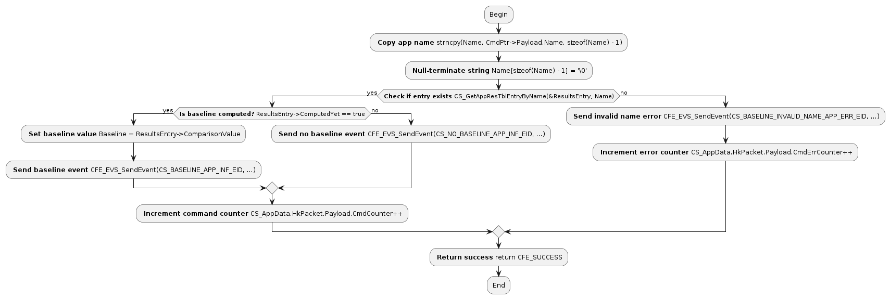

# 🤖 AutoFLC

https://github.com/user-attachments/assets/0ef52802-fd5e-4db3-8260-09444794a503

This is a Docker-based, enterprise-grade tool that automatically converts C project source code into PlantUML flowcharts. It integrates a Streamlit frontend, a multi-model LLM backend (OpenAI/Ollama), and a PlantUML rendering engine.

## 📂 Directory Structure

Make sure your project directory contains the following core files:

````text
.
├── Dockerfile          # Build Docker image
├── requirements.txt    # Python dependencies
├── app.py              # Run script
├── config.yaml         # Hyperparameter config, prompts, and language settings
└── history/            # Stores generated images and ZIP packages; folder name matches the task ID
````

## 🌐 Language Support

AutoFLC supports **Chinese (`zh`)** and **English (`en`)** for both UI labels and flowchart annotations.

To switch the language, edit **one line** in `config.yaml` and restart the container:

````yaml
# config.yaml
language: "en"   # "en" = English flowchart annotations + English UI
                 # "zh" = 中文流程图注释 + 中文界面
````

> **Note**: Changing the language affects the AI-generated flowchart node labels, the web UI text, and the user manual simultaneously.

## 🚀 Deployment and Usage Guide

### 1. Build the Image

````bash
docker build -t flowchart-agent .
````

### 2. Start the Container

````bash
docker run -d -p 8501:8501 \
  --name flowchart-dev \
  -v YOUR_PATH\config.yaml:/app/config.yaml \
  -v YOUR_PATH\app.py:/app/app.py \
  -v YOUR_PATH\history:/app/history \
  --add-host=host.docker.internal:host-gateway \
  flowchart-agent
````

> 💡 `config.yaml` is mounted as a volume, so you can switch languages or update prompts **without rebuilding the image** — just edit the file and restart the container.

### 3. Restart After Config Change

````bash
docker restart flowchart-dev
````

## 📖 User Guide

1. **Prepare**: Compress your C project folder (e.g., the `usr` directory) into a `.zip` file.
2. **Configure**:
   - Select an **AI model** in the left sidebar.
   - Adjust the **Max retries** slider (recommended: 10).
   - Adjust the **Skip short functions** slider (recommended: 0–5 lines).
3. **Run**: In the **"Start a new task"** tab, upload the ZIP file and click **"Start analysis in background"**.
4. **Monitor**: Switch to the **"Task monitor"** tab to view live logs.
   - Click the `>` icon before a log entry to expand and view the detailed code.
   - Click the red **"Abort task"** button to stop the task at any time.
5. **Deliver**: After the task completes, click **"Download results (Zip)"** to download all PNG images.

## 🔎 Example: C → Flowchart (CS_HousekeepingCmd)

**Input (C):**
````c
CFE_Status_t CS_ReportBaselineAppCmd(const CS_ReportBaselineAppCmd_t *CmdPtr)
{
    /* command verification variables */
    CS_Res_App_Table_Entry_t *ResultsEntry;
    uint32                    Baseline;
    char                      Name[OS_MAX_API_NAME];

    strncpy(Name, CmdPtr->Payload.Name, sizeof(Name) - 1);
    Name[sizeof(Name) - 1] = '\0';

    if (CS_GetAppResTblEntryByName(&ResultsEntry, Name))
    {
        if (ResultsEntry->ComputedYet == true)
        {
            Baseline = ResultsEntry->ComparisonValue;
            CFE_EVS_SendEvent(CS_BASELINE_APP_INF_EID, CFE_EVS_EventType_INFORMATION,
                              "Report baseline of app %s is 0x%08X", Name, (unsigned int)Baseline);
        }
        else
        {
            CFE_EVS_SendEvent(CS_NO_BASELINE_APP_INF_EID, CFE_EVS_EventType_INFORMATION,
                              "Report baseline of app %s has not been computed yet", Name);
        }
        CS_AppData.HkPacket.Payload.CmdCounter++;
    }
    else
    {
        CFE_EVS_SendEvent(CS_BASELINE_INVALID_NAME_APP_ERR_EID, CFE_EVS_EventType_ERROR,
                          "App report baseline failed, app %s not found", Name);
        CS_AppData.HkPacket.Payload.CmdErrCounter++;
    }

    return CFE_SUCCESS;
}
````

**Output (Flowchart):**



- Makes error-handling and telemetry path obvious at a glance
- Supports both **English** and **Chinese** annotation styles via `config.yaml`
- Helps with code structure comprehension and semantic understanding
